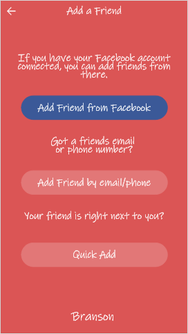

https://github.com/bstick2/midterm_cs3203/
# CS3203 Midterm
By Branson Stickney (ID: 112928835)
## Yo Application
Login Screen  
  
Sign Up Screens  

  
Home Screen  
  
Map Screen  
  
General Screen  
  
New Screen  
  
Add a Friend Screen  
  
Quick Add Screens (New Feature)  

  

## ACM Ethics Code
### Ethical Issues
Ethical issues that could occur with YO include but are not limited to:  
* The YO application has the ability to connect your profile to your Facebook account. In doing so, the app has the ability to find more personal information than what is actually required. The process of connecting your YO account to your Facebook account can lead to some private information being attained by the YO company. In order to stop this from happening, the YO application will also accept just creating an account on the app instead of conneting it to a Facebook account, giving the user more privacy.
* Another ethical issue that could arise is honesty. The YO company could make false claims, or just claims that have no evidence to support it. For example, the YO company could say "buy our app! It'll put you face to face with friends faster!" The problem with this statement is that the application is in no way connected to making a friend get around quicker, nor does it have anyway to solve the problem of traffic. In order to avoid this, the company will make statements that can be backed up with data or they will not speak on the subject.
* The YO app could be only available for iPhone users, which would mean that only people who use apple products would be able to use the YO app. This act would be called discrimination against android users, since the application is not readily available for all phone users.
### Legal Issues
Legal issues can be very troublesome, since you have to account for all locations that the app will be available in. Here are a few legal issues:
* Say the company is not doing well, so in order to make more money the company decided to sell the phone numbers of its users to a company that harasses people everyday by calling and offering them new insurance. The legal issue here is that the YO company has now given out confidential information, which would most likely move to a very heavy lawsuit against the company.
* The YO app has just released a new update, where now users can send a "YO" out onto Twitter. The problem is the company did not ask permission to do this with Twitter. So the company is using Twitter's trademark without their knowledge to increase the amount of flow on their applicaiton. This would be an illegal use of trademark!
* In Japan, the privacy laws are just a bit different than they are in the United States. Within Japan, a company must abide by the Act on the Protection of Personal Information (APPI) if they are storing data of 5,000 or more people. Say the YO company has released the app in Japan, but in order to not have to abide by their laws the company decided to botch the number of people using their application. They tell the government that they have less than 5,000 users and will not have to abide by the APPI. This would definitely find itself to a courtroom as this is postively against the laws of Japan.
### Professional Issues
Professional issues occur when a company does not meet the professional requirements of their code, some examples for this app could be:
* The company decides to use a random QR code generator that the new intern found online. The company takes the intern for her word and does not research the code generator. So when they put the application online, their users begin getting malware on their devices. When the company researches the issue, they find out that the QR code generator creates codes that send the users to a link that creates a Java Trojan horse download that infects the user with malware. The issue was initiated because the company did not hold itself to a professional standard. Their were many principles broken like 2.5, 2.8 and 2.9 of the ACM Code of Ethics. 
* Another professional issue that can occur is a break in employee-privacy. Say an employee decides they want to use the app. While doing so there is a breach of privacy from the app that shows a private post on facebook where the employee is talking about hailing satan. The employee is then fired, because the company believes in Christianity. This is a huge breach of professional privacy and cleary breaks Principle 2.9 of the ACM Code of Ethics.
* A large company wants to use YO in order to notify their employees of immediate dangers. The large corporation contacts the YO company and asks them to make an app that will test the air quality around the employee and notify them immediately to evacuate and where to evacuate to. In order to save money on the project the YO company just sticks with its normal staff to try to tackle this challenge. This is an immediate break of Principle 2.6 of the ACM Code of Ethics, because the the company does not know how to test air quality and are not giving the problem to an engineer with the requirements needs to solve this issue. The company should've hired a third party company to work with them in order to develop the new updated app.
